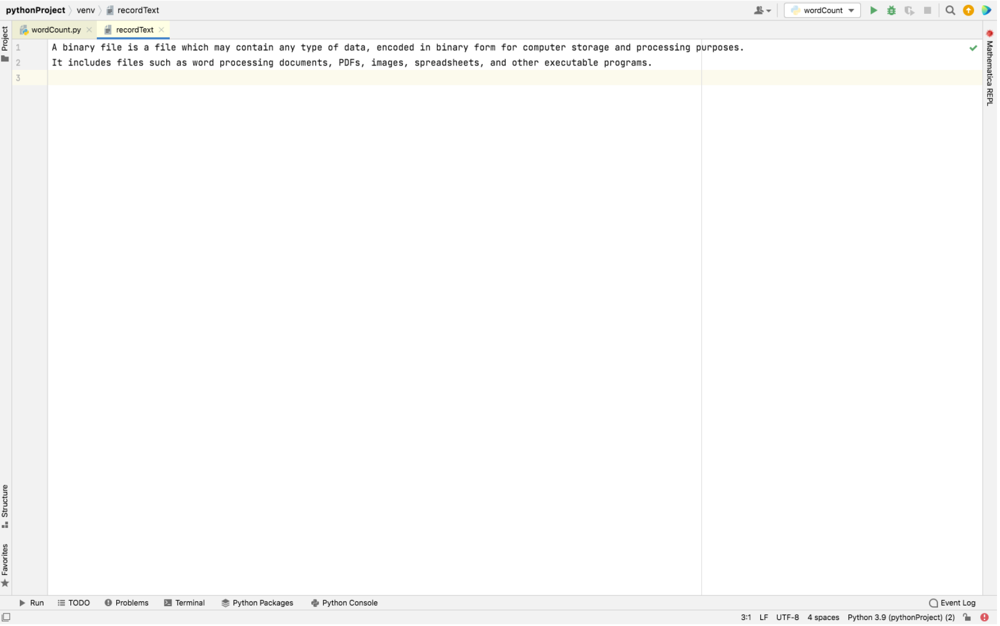

# Word-count
## AIM:
To write a python program for getting the word count from a text.
## EQUIPEMENT'S REQUIRED: 
PC
Anaconda - Python 3.7
## ALGORITHM: 
### Step1:
Start

### Step 2:
Declare a variable count equal to 0.

### Step 3:
Open the required text file in read mode as text.(any name can be used).

### Step 4:
Loop until variable i in file text.

### Step 5:
Declare variable word = i.split().

### Step 6:
Process count+=len(word) End loop

### Step 7:
Print the value of count, which has the number of words in the file

### Step 8:
Stop
## PROGRAM:
```
#Developed by:- Kandukuri Sai Eswar
#Reference number:- 21000679
count =0
with open('recordText','r') as text:
    for i in text:
        word = i.split()
        count+=len(word)
print('The number of words in the  file',text.name,'are :',count)
```
## OUTPUT:




## RESULT:
Thus the program is written to find the word count from a text.
